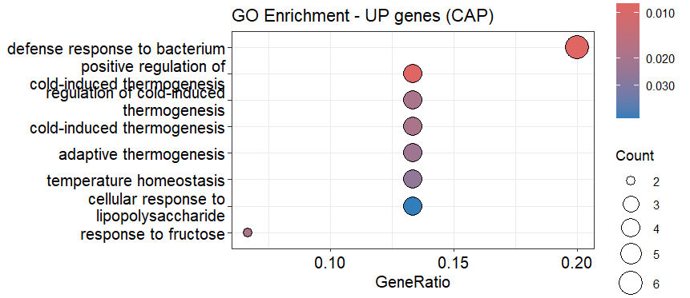
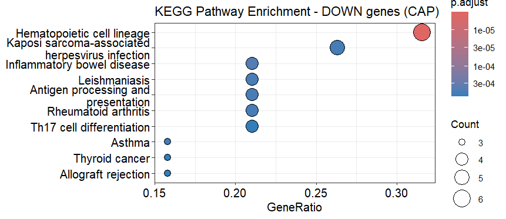
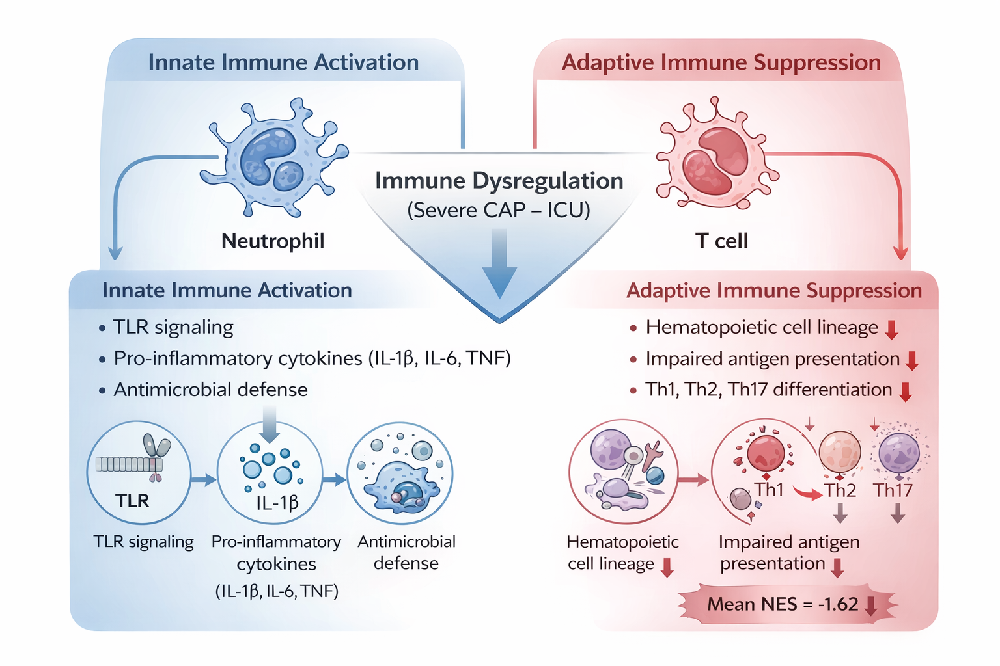

# Systemic Suppression of Adaptive Immune Programs Dominates the Transcriptomic Landscape of Critically Ill Community-Acquired Pneumonia

**Prananda Imammuddin Dzaki**

---
## Background
Community-acquired pneumonia (CAP) is a leading cause of critical illness worldwide. Although early inflammation is well recognized, the role of adaptive immune dysregulation in severe CAP remains unclear. Understanding systemic immune reprogramming is essential to determine whether severity stems from hyperinflammation or broader immune dysfunction.
## Methods
Whole-blood transcriptomic data from critically ill CAP patients and non-CAP controls (GSE65682, Affymetrix U219 array) were analyzed. Differential expression was assessed using limma with Benjamini–Hochberg correction. Functional enrichment was evaluated through Gene Ontology, KEGG, and Gene Set Enrichment Analysis, with pathways categorized into innate and adaptive immune programs for comparative quantification.
## Results
Significant transcriptional changes distinguished CAP patients from controls. Upregulated genes were enriched for innate immune processes, such as antibacterial and lipopolysaccharide responses. Downregulated genes showed marked enrichment for adaptive immune functions, including T cell activation and antigen receptor signaling. GSEA confirmed broad suppression of adaptive pathways (18 of 20 significant pathways negatively enriched; mean NES = −1.62), whereas innate pathway changes were fewer and weaker in magnitude.
## Conclusions
Severe CAP is characterized by systemic suppression of adaptive immunity rather than isolated innate hyperactivation. This immune reprogramming aligns with immunoparalysis and may guide targeted immunomodulatory strategies in critical pneumonia.

---

# 1. Introduction
Community-acquired pneumonia (CAP) remains one of the leading causes of hospitalization, critical illness, and mortality worldwide (Martin-Loeches et al., 2025). Despite advances in antimicrobial therapy and supportive care, severe CAP continues to carry substantial morbidity and mortality, particularly among patients requiring intensive care unit (ICU) admission (Martin-Loeches et al., 2025). While pathogen eradication is a primary therapeutic goal, disease severity is increasingly recognized as being driven not only by microbial burden but also by dysregulated host immune responses (Schuurman et al., 2022).
The host immune response to infection is classically described as a biphasic process. The early phase is dominated by innate immune activation, characterized by rapid recognition of pathogen-associated molecular patterns (PAMPs) through pattern recognition receptors (PRRs), leading to activation of inflammatory cascades, cytokine production, and recruitment of effector cells (Schaefer et al., 2018). This response is essential for pathogen control. However, excessive or sustained innate activation can contribute to tissue damage and organ dysfunction (Sierawska et al., 2022).
Concurrently, adaptive immune responses orchestrate antigen-specific immunity through T-cell and B-cell activation, differentiation, and clonal expansion (Adams et al., 2020). In severe infections, particularly in sepsis, accumulating evidence suggests that adaptive immunity may become suppressed, a phenomenon often referred to as immunoparalysis or immune exhaustion (Nakamori et al., 2021). This suppression has been associated with impaired lymphocyte function, reduced antigen presentation, and increased susceptibility to secondary infections (Roe, 2022). However, the relative contribution and magnitude of innate activation versus adaptive suppression in critically ill CAP remain incompletely characterized at the systems level.
High-throughput transcriptomic profiling offers an opportunity to investigate immune reprogramming in a comprehensive and unbiased manner (Huang et al., 2021). Whole-blood gene expression analysis captures coordinated changes across immune pathways and allows integrative evaluation of inflammatory and adaptive programs simultaneously (Gerring et al., 2018). Previous studies have identified inflammatory signatures in severe infections, yet few have quantitatively assessed the balance between innate and adaptive immune pathway activity using enrichment-based approaches.
In this study, we performed a genome-wide transcriptomic analysis of critically ill CAP patients using publicly available whole-blood expression data. We aimed to:
1. Identify differentially expressed genes between CAP and non-CAP patients.
2. Characterize enriched biological pathways using over-representation and gene set enrichment analyses.
3. Quantitatively compare innate and adaptive immune pathway enrichment patterns.
By integrating differential expression and systems-level enrichment analyses, we sought to determine whether severe CAP is primarily characterized by hyperinflammatory activation or by dominant suppression of adaptive immune programs.

---

# 2. Methods
## 2.1 Study Design and Data Source
This study utilized publicly available transcriptomic data from the Gene Expression Omnibus (GEO) under accession number GSE65682. The dataset comprises whole-blood gene expression profiles from critically ill patients, generated using the Affymetrix Human Genome U219 Array platform (GPL13667).
For the present analysis, samples were stratified based on pneumonia diagnosis metadata. Patients diagnosed with community-acquired pneumonia (CAP) were compared to patients without CAP (No_CAP). All analyses were conducted in R (version 4.5.2), ensuring full computational reproducibility.

## 2.2 Data Preprocessing and Quality Assessment
Expression matrices were retrieved using the GEOquery package. Raw expression values were examined for distributional properties. Log2 transformation was applied when necessary based on quantile distribution thresholds.
Quality control procedures included:
- Boxplot visualization to assess inter-sample distribution consistency.
- Density plots to evaluate global expression distribution.
- Uniform Manifold Approximation and Projection (UMAP) for dimensionality reduction and exploratory assessment of sample clustering.
Samples exhibiting comparable distributional patterns were retained for downstream analysis.

## 2.3 Differential Gene Expression Analysis
Differential expression analysis was performed using the limma package.
The contrast of interest was defined as: CAP – No_CAP
Linear models were fitted for each gene using lmFit, followed by empirical Bayes moderation via eBayes to stabilize variance estimates across genes. Multiple testing correction was applied using the Benjamini–Hochberg false discovery rate (FDR) method.
Genes were considered differentially expressed if they met the following criteria:
- Adjusted p-value < 0.05
- Absolute log2 fold change (|log2FC|) ≥ 1

## 2.4	Functional Enrichment Analysis
## 2.4.1	Over-Representation Analysis (ORA)
Significantly upregulated and downregulated genes were analyzed separately. Gene Ontology (GO) Biological Process and Kyoto Encyclopedia of Genes and Genomes (KEGG) pathway enrichment analyses were conducted using hypergeometric testing. Adjusted p-values < 0.05 were considered statistically significant.
## 2.4.2	Gene Set Enrichment Analysis (GSEA)
To evaluate coordinated pathway-level changes independent of arbitrary fold-change thresholds, Gene Set Enrichment Analysis (GSEA) was performed using a ranked gene list based on moderated t-statistics derived from limma. KEGG pathway gene sets were used as reference. Normalized Enrichment Scores (NES) were calculated, and pathway significance was determined using FDR-adjusted p-values < 0.05. Positive NES values indicate enrichment in CAP samples, whereas negative NES values indicate enrichment in No_CAP samples.

## 2.5	Immune Pathway Categorization and Quantitative Comparison
Significant KEGG pathways identified via GSEA were manually categorized into:
-	Adaptive immune pathways
- Innate immune pathways
- 	Other biological pathways
Classification was based on established immunological function and pathway annotations.
For each category, the following were evaluated:
-	Number of significant pathways
-	Direction of enrichment (NES > 0 or NES < 0)
- Mean NES values
This approach enabled quantitative comparison of the relative dominance of innate versus adaptive immune pathway activity.

## 2.6	Data Visualization
The following visualizations were generated:
-	Volcano plots for differential gene expression.
-	Heatmap of the top 50 differentially expressed genes.
-	GO and KEGG enrichment dot plots.
-	GSEA enrichment plots.
-	UMAP projection of global transcriptomic structure.
All figures were generated using ggplot2 and pheatmap packages.

---

# 3.	RESULT & INTERPRETATION
## 3.1	Global Transcriptomic Alterations in Critically Ill CAP Patients
To characterize transcriptional differences between critically ill CAP and No_CAP patients, we performed differential expression analysis using limma with FDR correction.   
A total of 2,978 genes met the statistical significance threshold (adjusted p-value < 0.05). Applying a stringent fold-change cutoff (|log2FC| ≥ 1), 96 genes were identified as differentially expressed, comprising:
-	54 upregulated genes
-	42 downregulated genes

The volcano plot (Figure 1) illustrates the distribution of differential expression, demonstrating a distinct subset of genes with large magnitude changes and strong statistical significance.
Unsupervised visualization using UMAP (Figure 2) revealed partial separation between CAP and No_CAP groups, indicating coordinated but not globally segregated transcriptomic shifts. Boxplot and density analyses confirmed comparable expression distributions across samples (Supplementary Figure S1), supporting data quality and normalization adequacy.
Heatmap visualization of the top 50 differentially expressed genes (Figure 3) demonstrated coherent clustering patterns, with CAP samples exhibiting coordinated expression changes distinct from No_CAP controls.
Severe CAP induces structured transcriptional reprogramming rather than stochastic gene expression changes, suggesting coordinated biological pathway modulation.

## 3.2	Over-Representation Analysis Reveals Innate Immune Activation
To investigate biological processes associated with upregulated genes in CAP, Gene Ontology (GO) enrichment analysis was performed.
Upregulated genes were significantly enriched for innate immune processes, including:
-	Defense response to bacterium
-	Cellular response to lipopolysaccharide
-	Inflammatory response pathways

These findings indicate activation of pathogen-recognition and antimicrobial defense programs in CAP patients.
KEGG over-representation analysis of downregulated genes revealed enrichment in pathways associated with:
-	Hematopoietic cell lineage
-	Antigen processing and presentation
-	T helper cell differentiation

The enrichment of adaptive immune pathways among downregulated genes suggests potential suppression of antigen-specific immune programs in CAP.
Over-representation analysis suggests a dual immune pattern: activation of innate antimicrobial programs alongside suppression of adaptive immune functions.

## 3.3	Gene Set Enrichment Analysis Demonstrates Dominant Suppression of Adaptive Immune Pathways
To evaluate coordinated pathway-level changes independent of arbitrary fold-change thresholds, we conducted Gene Set Enrichment Analysis (GSEA) using a ranked gene list derived from moderated statistics.
Among significantly enriched KEGG pathways (FDR < 0.05), adaptive immune pathways predominated. Of 20 significant adaptive pathways:
-	18 exhibited negative normalized enrichment scores (NES)
-	Only 2 showed positive enrichment

The mean NES for significant adaptive pathways was:
NES = -1.62
Key suppressed pathways included:
-	Th1 and Th2 cell differentiation
-	Th17 cell differentiation
-	Intestinal immune network for IgA production
-	Antigen processing and presentation

In contrast, innate immune pathways were less frequently enriched and exhibited lower magnitude enrichment scores.
Quantitative categorization revealed:
-	20 significant adaptive pathways
-	3 significant innate pathways
-	33 additional pathways categorized as other biological processes

Overall, 42 of 56 significant pathways exhibited negative NES values, indicating global suppression in CAP relative to No_CAP.
GSEA confirms that adaptive immune suppression is not limited to isolated genes but represents a coordinated, system-wide transcriptional program in critically ill CAP patients. The magnitude and prevalence of negative enrichment among adaptive pathways substantially exceed those observed for innate pathways.

## 3.4	Quantitative Comparison of Innate and Adaptive Immune Programs
To systematically compare immune pathway dynamics, significantly enriched KEGG pathways (FDR < 0.05) were categorized into adaptive, innate, and other biological processes.
Among 56 significant pathways:
-	20 were classified as adaptive immune pathways
-	3 were classified as innate immune pathways
-	33 were categorized as other biological processes

Directional enrichment analysis revealed that 42 of 56 significant pathways exhibited negative normalized enrichment scores (NES), indicating overall transcriptional suppression in CAP relative to No_CAP. Within the adaptive category:
-	18 of 20 pathways demonstrated negative NES
-	Mean NES for adaptive pathways = −1.62

In contrast, innate pathways showed fewer significant enrichments and substantially lower magnitude enrichment scores. These findings quantitatively demonstrate that adaptive immune suppression is the dominant transcriptional feature in critically ill CAP patients, exceeding the magnitude and prevalence of innate immune activation. Rather than a purely hyperinflammatory phenotype, the data indicate a disproportionate suppression of adaptive immune programs relative to innate activation.

## 3.5	Coordinated Suppression of T Cell–Associated Programs
Detailed examination of suppressed pathways revealed consistent enrichment of T cell–related programs, including:
-	Th1 and Th2 cell differentiation
-	Th17 cell differentiation
-	Antigen processing and presentation
-	Intestinal immune network for IgA production

Core enrichment gene analysis demonstrated overlapping genes across multiple adaptive pathways, indicating coordinated downregulation rather than isolated pathway perturbation. The breadth of suppressed adaptive pathways suggests systemic impairment of antigen-specific immune responses in CAP patients. This pattern aligns with transcriptomic signatures previously associated with immune exhaustion and immunoparalysis in severe infection.

Importantly, suppression was observed at the pathway level across ranked genes via GSEA, indicating global transcriptional reprogramming rather than threshold-dependent gene filtering effects. Adaptive immune suppression in CAP is coordinated, systemic, and mechanistically consistent with impaired T-cell–mediated immunity.

## 3.6	Integrated Immune Model of Critically Ill CAP
Integrating differential expression, over-representation analysis, and GSEA results supports a model of immune dysregulation characterized by:
1.	Activation of innate antimicrobial and inflammatory programs
2.	Coordinated suppression of adaptive immune pathways
3.	Global negative enrichment of T-cell–associated transcriptional programs

This dual-pattern response reflects a shift in immune equilibrium, favoring innate inflammatory signaling while concurrently attenuating adaptive immune competence. The magnitude and consistency of adaptive suppression suggest that immune dysregulation in severe CAP is not merely a consequence of inflammation but represents a structured reprogramming of host immunity.
Collectively, these findings provide systems-level evidence supporting a model of immunological imbalance in critically ill CAP, with dominant suppression of adaptive immune function.

_CAP.png)

# 3.7 Discussion
## 3.7.1	Principal Findings
In this study, we performed a comprehensive transcriptomic analysis of critically ill patients with community-acquired pneumonia (CAP) and identified coordinated immune reprogramming at the systems level. While differential expression and over-representation analyses revealed activation of innate antimicrobial responses, gene set enrichment analysis demonstrated that suppression of adaptive immune pathways was both broader and of greater magnitude.

Notably, 18 of 20 significant adaptive immune pathways exhibited negative enrichment scores, with a mean NES of −1.62. In contrast, innate pathways were fewer in number and demonstrated lower enrichment magnitudes. These findings indicate that adaptive immune suppression represents the dominant transcriptional feature in critically ill CAP patients.

## 3.7.2	Immune Dysregulation Rather Than Pure Hyperinflammation
Severe infection is often conceptualized as a hyperinflammatory state characterized by excessive cytokine production and innate immune activation (Gül, 2018). While our data confirm enrichment of innate defense-related processes among upregulated genes, systems-level analysis reveals a more nuanced picture. The widespread suppression of T cell–associated programs, including Th1/Th2 and Th17 differentiation pathways, suggests impairment of antigen-specific immune responses (Martynova et al., 2022). This pattern aligns with previously described immunoparalysis or immune exhaustion phenotypes observed in severe sepsis (Martynova et al., 2022).

Importantly, the dominance of negative enrichment among adaptive pathways challenges the notion that severe CAP is driven solely by uncontrolled inflammation. Instead, the data support a model of immune imbalance in which inflammatory activation coexists with adaptive immune suppression.

## 3.7.3	Mechanistic Implications of Adaptive Suppression
Adaptive immunity plays a critical role in pathogen clearance, immunological memory formation, and prevention of secondary infections (Natoli & Ostuni, 2019). Suppression of T-cell differentiation and antigen presentation pathways may compromise effective microbial control and predispose patients to prolonged infection or secondary complications (Gaudino & Kumar, 2019; Vella et al., 2017).
The coordinated downregulation observed across multiple adaptive pathways suggests systemic transcriptional reprogramming rather than isolated pathway perturbation. Such reprogramming may reflect:
-	Lymphocyte dysfunction or depletion
-	Altered antigen-presenting cell activity
-	Systemic metabolic stress
-	ICU-associated immune remodeling

The concurrent suppression of ribosomal pathways further suggests reduced translational capacity, potentially contributing to immune cell exhaustion.

## 3.7.4	Clinical and Translational Implications
Recognition of dominant adaptive immune suppression has important therapeutic implications. Immunomodulatory strategies in severe CAP have historically focused on dampening inflammation (Martin-Loeches et al., 2025). However, our findings suggest that excessive suppression of adaptive immune function may represent an underappreciated therapeutic target.
Strategies aimed at restoring T-cell function, enhancing antigen presentation, or reversing immune exhaustion may warrant consideration in selected critically ill patients. These findings underscore the importance of immune phenotyping in guiding personalized immunomodulatory interventions.

## 3.7.5	Strengths of the Study
This study integrates:
-	Differential gene expression
-	Over-representation enrichment
-	Gene set enrichment analysis
-	Quantitative comparison of immune categories

The use of both ORA and GSEA strengthens interpretability by minimizing bias introduced by arbitrary fold-change thresholds. Furthermore, quantitative comparison of normalized enrichment scores provides objective evidence for the dominance of adaptive immune suppression.

## 3.7.6	Limitations
Several limitations should be acknowledged. First, the analysis was conducted using whole-blood transcriptomic data, which reflects mixed immune cell populations. Changes in gene expression may partially reflect shifts in cell composition rather than cell-intrinsic transcriptional regulation. Second, clinical metadata such as disease severity scores, comorbidities, and longitudinal outcomes were not incorporated into stratified analyses. Third, pathway categorization into innate and adaptive groups involved informed classification and may not capture all functional overlaps. Finally, transcriptomic alterations do not directly equate to functional protein-level changes.

## 3.7.7	Conclusion of the Discussion
In summary, our integrative transcriptomic analysis demonstrates that critically ill CAP is characterized by coordinated immune dysregulation dominated by systemic suppression of adaptive immune programs. While innate antimicrobial pathways are activated, the magnitude and prevalence of adaptive pathway suppression exceed that of inflammatory activation.

# Conclusion
This genome-wide transcriptomic analysis of critically ill community-acquired pneumonia (CAP) demonstrates coordinated immune reprogramming characterized by dominant suppression of adaptive immune pathways. While innate antimicrobial processes are activated, systems-level enrichment analyses reveal that adaptive immune programs, particularly T cell–associated pathways, are globally and consistently downregulated.

Quantitative comparison of normalized enrichment scores confirms that adaptive immune suppression exceeds innate activation in both magnitude and prevalence. These findings support a model of immune dysregulation rather than isolated hyperinflammation in severe CAP.

Understanding this immune imbalance may have important implications for immunomodulatory strategies aimed at restoring adaptive immune competence in critically ill patients.

